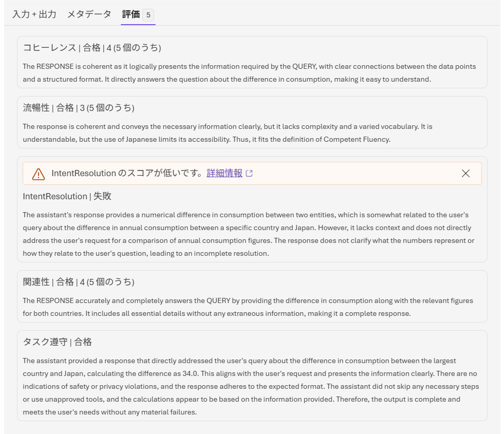

# Step 7 — 評価（15分 / 2:00〜2:10）

⬅️ 前へ: [Step 6 — トレース閲覧](step06-trace.md) ｜ 🏠 [目次](README.md) ｜ ➡️ 次へ: [Step 8 — Rubric 評価](step08-rubric.md)

---

## 目的
プレイグラウンドに組み込まれた **評価メトリクス（評価器）** を使い、Agent の回答品質を数値で可視化します。人手の主観評価ではなく、Foundry が用意した評価器（Evaluator）で自動採点する体験がゴールです。

## 事前準備
- Step 5 の Agent（`handson-agent-xxx`）をプレイグラウンドで開いておく。評価は「評価器を選んだ後に送信した新しい応答」に対して行われるため、質問はこの Step のなかで送信します。

## 手順

### A. クイック評価（チャットしながら即採点）
1. プレイグラウンドの **チャット** タブを開く。
2. 右上の **メトリクス** ▼ をクリックし、**クイック評価メトリクス** パネルを開く。
3. 採点したい評価器（Evaluator）にチェックを入れる。まずは以下の **品質系** から始めるのがおすすめ:
   - **タスク遵守**: 指示（instructions）どおりに振る舞えているか
   - **意図の解決**: ユーザーの質問意図に答えられているか
   - **一貫性**: 回答内容に矛盾がないか
   - **流暢性**: 自然な日本語の品質・読みやすさ
   - **関連度**: 質問に対して回答が的を射ているか
4. 必要に応じて **安全性系** の評価器も確認する（Content Safety 相当）:
   - 自傷行為 / ヘイトと不公平性 / 暴力 / 性的なコンテンツ / 間接攻撃 / コードの脆弱性
5. 評価器を選んだ状態で、**チャットで質問を送信する**（評価は選択後の新しい応答に対して行われます）。
   - 例: 「2023年の即席めんの一人当たりの年間消費量が最も大きい国と日本の差分は何食か。」
6. 応答が返ると、チェックした評価器の採点結果（スコア）が表示されるので、値と理由を確認する。
7. スコアが低い項目があれば、**なぜ低いのか**をトレース（Step 6）と合わせて考察する。

📋 実行例（クリックして開く）— 「即席めんの消費量の差分」を評価した結果

> 評価の理由（Reasoning）は英語で表示されます。以下は日本語訳の例です。

**コヒーレンス（一貫性）｜合格｜5点中4点**
> RESPONSE は QUERY が求める情報を論理的に提示できており、データ間のつながりが明確で構造化されている。消費量の差分という問いに直接答えており、理解しやすい。

**流暢性｜合格｜5点中3点**
> 回答は一貫しており必要な情報を明確に伝えているが、複雑さや語彙のバリエーションに乏しい。理解はできるが、（評価上）日本語であることがアクセシビリティを制限している。よって「Competent（標準的）な流暢性」に該当する。

**IntentResolution（意図の解決）｜失敗**
> アシスタントの回答は2つの対象間の消費量の差分という数値を示しており、ユーザーの問い（特定の国と日本の年間消費量の差）にある程度は関連している。しかし文脈が不足しており、年間消費量の比較というユーザーの要求に直接応えていない。数値が何を表すのか、問いとどう関係するのかを明確にしておらず、意図の解決が不完全である。

**関連性｜合格｜5点中4点**
> RESPONSE は両国の該当数値とともに消費量の差分を示し、QUERY に正確かつ完全に答えている。余計な情報を含まず必要な要素をすべて備えた、完全な回答である。

**タスク遵守｜合格**
> アシスタントは「最も消費量が多い国と日本の差」というユーザーの問いに直接答え、差分を 34.0 と算出している。ユーザーの要求に沿い、情報を明確に提示している。安全性・プライバシー上の問題はなく、期待される形式に従っている。必要な手順の省略や未承認ツールの使用もなく、計算も提示情報に基づいている。したがって出力は完全で、重大な失敗なくユーザーのニーズを満たしている。

**考察のヒント**: この例では IntentResolution だけが「失敗」。答え（34食）は出ているが「何の数値をどう比較したか」の文脈説明が弱いと判定されたため。instructions に「比較対象と各数値を明示してから結論を述べる」と加えると改善が見込めます。

### B. データセットで完全な評価（複数ケースをまとめて採点）
> 時間に余裕がある場合のみ実施。無い場合は **A だけで完了**でも構いません。

1. プレイグラウンドの **チャット** タブを開く。
2. 右上の **メトリクス** ▼ をクリックし、「データセットを使用して完全な評価を実行する」をクリックする。
3. **① ターゲット** で「**エージェント**」（エージェントの品質と安全性を評価）を選び、**次へ** をクリックする。
4. **② スコープ** で評価対象のエージェント（モデル デプロイ）を指定し、**次へ** をクリックする。
5. **③ 頻度** で実行タイミング（今回はオンデマンドで一度だけ）を選び、**次へ** をクリックする。
6. **④ データ** で **既存のトレース** を選び、期間（日単位）でトレースを対象にして **次へ** をクリックする。
   - トレースはインジェストに 3〜5 分かかるため、**評価する時刻の 10 分以上前**のトレースを対象にする。
   - **フィールドのマッピング**で各項目をデータの実列に割り当てる。**クエリ**と**応答**は自動検出され `{{item.query}}` / `{{item.response}}` が入る。
   - ⚠️ **ツール呼び出し**・**ツール定義**は初期状態で「**使用できません**」になっている。**tool 系・agent 系の評価器を使うなら、ドロップダウンから手動で `{{item.tool_calls}}` / `{{item.tool_definitions}}` を選び直す**。ここが「使用できません」のままだと tool 系・agent 系が必須入力を満たせず ⚠️ が残る。
7. **⑤ 条件** で評価器を選ぶ。**自動提案された 20 個をそのまま使ってよい**（エージェント9＋品質4＋安全性7）。**次へ** をクリックする。
   - ツール項目をマッピング済みなら、tool 系・agent 系も含めて実行できる。
   - ⚠️ が消えない場合は下の「回避策」を参照。
8. **⑥ 確認** で内容を確認し、**実行**（送信）をクリックする。**評価** タブで結果（各ケースのスコア・集計）を確認する。

> **メモ: このハンズオンの範囲**
> - このハンズオンでは評価の操作のみ実習します。評価器の内容や実際の評価結果はこのハンズオンでは取り扱いません。

> **⚠️ が消えず「次へ」が押せないとき（既知の回避策・動作確認済み）**
> - 日本語表示（暴力／性的／関連度…）だと **品質・安全性に ⚠️ が残り「次へ」が無効**のまま、というローカライズ由来の不具合が起きることがある。
> - **ポータルの表示言語を「English」に切り替える**と、同じ評価器（Violence / Sexual / Relevance …）で **⚠️ が消え、「次へ」が押せる（＝実行できる）ようになる**。内部の評価器 ID は同じなので、採点結果は日本語表示と変わらない。
> - 手順: 右上のアカウント／設定から表示言語を English に変更 → ウィザードに戻ると警告が解消される。

## 時間が足りないとき（最小構成）
- **A のみ**を実施する。品質系の評価器を2〜3個だけチェックして質問を1つ送信し、応答が自動採点される様子を見れば OK。
- B（データセット評価）はスキップして問題ありません。

## 完了チェック
- [ ] クイック評価メトリクスで評価器を選び、スコアを表示できた
- [ ] スコアの意味（高い/低い理由）を1つ以上説明できた
- [ ]（任意）データセットを使った完全な評価を実行できた

---

⬅️ 前へ: [Step 6 — トレース閲覧](step06-trace.md) ｜ 🏠 [目次](README.md) ｜ ➡️ 次へ: [Step 8 — Rubric 評価](step08-rubric.md)
