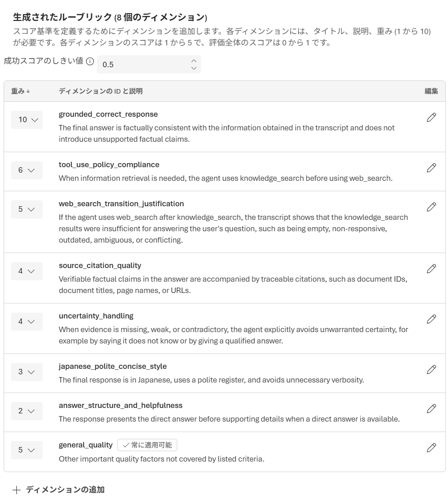

# Step 8 — Rubric 評価（ルーブリック採点）（15分 / 2:10〜2:25）

⬅️ 前へ: [Step 7 — 評価](step07-eval.md) ｜ 🏠 [目次](README.md) ｜ ➡️ 次へ: [Step 9 — Microsoft 365 / Teams への公開](step09-m365-publish.md)

---

## 目的
Step 7 では Foundry が用意した**組み込みの評価器**（品質・安全性など）で採点しました。この Step では、**自分たちの「良い回答」の定義**を採点基準として持ち込める **Rubric 評価器（ルーブリック評価器）** を体験します。

Rubric 評価器を使うと、「ポリシー遵守」「ツールの使い方の正しさ」「言い回しの丁寧さ」など、**このエージェントで本当に重視したい観点**を重み付きの基準として定義し、LLM ジャッジに一貫して採点させられます。

> **（事実）** Rubric 評価器はプレビュー機能です。出典: <https://learn.microsoft.com/azure/foundry/concepts/evaluation-evaluators/rubric-evaluators>

## Rubric（ルーブリック）とは
- **Rubric** = 回答をどう採点するかを定義した「基準の集合」。
- 各 Rubric は複数の **dimension（採点観点）** を持つ。
- 各 dimension には次の要素がある:
  | 要素 | 意味 |
  |---|---|
  | `id` | 観点の識別子（例: `policy_enforcement`）。 |
  | `description` | その観点が「何を測るか」を具体的に書いた説明。 |
  | `weight` | その観点の相対的な重要度（重み）。 |
  | `always_applicable` | `true` なら関連性に関わらず毎回採点する（総合品質などに使う）。 |
- LLM ジャッジが各観点を **1〜5点** で採点し、**重み付き平均を 0〜1 に正規化**したものが総合スコアになる。
- 総合スコアが **しきい値（既定 0.5）** 以上なら **pass**、未満なら **fail**。

> **（事実）** 採点は 1〜5 点、総合スコアは重み付き平均を 0–1 に正規化、既定しきい値は 0.5。出典: 上記 Rubric evaluators ページ。

## 事前準備
- Step 3〜5 で作成した Agent（`handson-agent-<自分の名前>`）があること。
- 採点用のジャッジ モデルとして **gpt-5.4**（または gpt-5.4-mini / gpt-5.5 など推奨モデル）のデプロイがあること。

## 手順

### A. Rubric 評価器を自動生成する
1. Foundry プロジェクトで **評価（Evaluation）** を開き、**評価器カタログ（Evaluator catalog）** に移動して、**エバリュエーターの作成** を開く。
2. 「エバリュエーターの作成」画面で、次のとおり入力する。

   | 項目 | 設定値（このハンズオン） | 補足 |
   |---|---|---|
   | **評価者名** ✱ | `rubric-handson-<自分の名前>` | 半角英数字・ハイフンで一意に。必須。 |
   | **表示名** | `Rubric ハンズオン` | 一覧で見やすい名前（省略可）。 |
   | **説明** | `自分の Agent 向けに重視する観点を採点する Rubric` | 省略可。 |
   | **評価者の種類** ✱ | **ルーブリック** を選択 | 「プロンプト」「コード」は選ばない。 |
   | **ルーブリックの自動生成** | **オン**（トグルを右に） | Agent の文脈から採点観点を自動生成する。 |
   | **モデル** ✱ | **gpt-5.4** を選択 | ジャッジ（採点）モデル。gpt-5.4-mini / gpt-5.5 でも可。必須。 |
   | **対象エージェント（省略可能）** | Step 3〜5 の Agent `handson-agent-<自分の名前>` を選択 | 選ぶと、その Agent の instructions が **エージェントの指示** 欄に自動で入る。 |
   | **エージェントの指示** | **自動で入る（そのままでOK）** | 対象エージェントを選ぶと、その Agent の instructions（システムプロンプト）が自動で入る。生成器はこれを文脈として採点観点を推定する。 |
   | **プロンプト** ✱ | **下記の例文を入力する** | **自動では入らない。** この欄は「何を評価するか（採点の観点）」を書く欄なので、下記の例文を貼り付ける。必須。 |
   | **コンテキスト（省略可能）** | **オフ**のまま | 追加の参照資料を渡したいときだけオンにする。**（注）プレビュー中のため、オンにするとルーブリック生成が 502（Bad Gateway）で失敗するケースがある。まずはオフで生成すること。** |
   | **詳細オプション** | 開かなくてよい | しきい値などの微調整用。既定のままで可。 |

   **プロンプト欄について**：対象エージェントを選ぶと **エージェントの指示** 欄には Agent の instructions（システムプロンプト）が自動で入りますが、**プロンプト 欄は自動では入りません**。この欄は「**何を評価するか（採点の観点）**」を書く欄なので、次の例文を自分で入力してください。

   **評価観点を明示したい場合の例文**（上書き用）:

   > このエージェントの回答を、①ユーザーの意図を正しく理解しているか、②Web Search / MCP など適切なツールを正しく使えているか、③根拠（出典）を示せているか、④簡潔で丁寧に応答しているか、の観点で評価してください。良い回答は、正確な情報を根拠付きで簡潔に返すものです。

3. 入力後、画面下部の **作成 / 生成** を押すと、Agent の文脈とプロンプトから採点観点（dimensions）が自動生成される。

<details>
<summary>🖼️ 生成結果の画面例（クリックして開く）</summary>



**画面の内容（日本語訳）**

> **生成されたルーブリック（8 個のディメンション）**
> スコア基準を定義するためにディメンションを追加します。各ディメンションには、タイトル、説明、重み（1 から 10）が必要です。各ディメンションのスコアは 1 から 5 で、評価全体のスコアは 0 から 1 です。
>
> **成功スコアのしきい値**: `0.5`

| 重み | ディメンションの ID | 説明（日本語訳） | 常に適用 |
|---:|---|---|:--:|
| 10 | `grounded_correct_response` | 最終回答がトレースで得られた情報と事実整合し、裏付けのない事実主張を持ち込まない。 | |
| 6 | `tool_use_policy_compliance` | 情報検索が必要なときは、web_search の前に knowledge_search を使う。 | |
| 5 | `web_search_transition_justification` | knowledge_search の後に web_search を使う場合、その検索結果が空・無応答・古い・曖昧・矛盾など不十分だったことがトレースで示されている。 | |
| 4 | `source_citation_quality` | 回答中の検証可能な事実主張に、ドキュメント ID・タイトル・ページ名・URL など追跡可能な出典が付いている。 | |
| 4 | `uncertainty_handling` | 根拠が欠落・脆弱・矛盾しているとき、エージェントは根拠のない断定を避ける（分からないと述べる、または留保付きで答える）。 | |
| 3 | `japanese_polite_concise_style` | 最終応答が日本語で、丁寧な口調で、不要に冗長でない。 | |
| 2 | `answer_structure_and_helpfulness` | 直接的な答えがある場合、補足の詳細より先に結論を提示する。 | |
| 5 | `general_quality` | 上記の基準に含まれないその他の重要な品質要素。 | ✓ |

> 画面右の ✏️ で各ディメンションを編集、下部の **＋ ディメンションの追加** で観点を追加できます。

</details>

> **メモ: UI 上の呼び名について**
> 新ポータルでは「Rubric 評価器」を **エバリュエーター（ルーブリック）** と表記します。`評価者名` `評価者の種類` などの「評価者」は本ドキュメントの「評価器 / Rubric」と同じものです。

> **メモ: このハンズオンの範囲**
> このハンズオンでは Rubric の **生成・確認・実行という操作** を体験します。生成された観点の良し悪しや、実際の採点結果の妥当性はこのハンズオンでは深追いしません。

### B. 生成された Rubric を確認・調整する
1. 生成された各 dimension の `description` と `weight` を確認する。
   - 重要な観点ほど `weight` が大きい（生成時は最重要の1つが 8〜10、その他が 1〜6 に割り振られる）。
2. 必要なら次を調整する（**時間があれば**）:
   - `description` をより具体的に書き換える（採点のブレが減る）。
   - 観点を **追加 / 削除** する。
   - **しきい値（pass threshold）** を 0.0〜1.0 で調整する（上げると厳しく、下げると緩く）。
   - **総合品質**の観点には **Always applicable** を付けておくと毎回採点される。
3. 最初は **自動生成のまま** で構いません。まず1回動かして、結果を見てから調整するのが定石です。

<details>
<summary>📋 Rubric の例（クリックして開く）— レストラン予約エージェント向け</summary>

```json
[
  { "id": "intent_recognition",   "description": "予約意図（新規・変更・キャンセル・問い合わせ）を正しく識別し、不要な聞き返しをせずに適切なフローを進める。", "weight": 9 },
  { "id": "tool_usage_accuracy",  "description": "正しいツールを正しいパラメーターで呼ぶ。不要な呼び出しをせず、必要な呼び出しを飛ばさない。", "weight": 6 },
  { "id": "policy_enforcement",   "description": "業務ルール（営業時間・最大人数・予約可能期間）を守り、違反する予約を作らない。", "weight": 5 },
  { "id": "communication_clarity","description": "簡潔で分かりやすく、確定前に予約内容を確認し、丁寧な口調で応答する。", "weight": 2 },
  { "id": "general_quality",      "description": "上記に含まれないその他の重要な品質要素。", "weight": 5, "always_applicable": true }
]
```

> 出典: <https://learn.microsoft.com/azure/foundry/concepts/evaluation-evaluators/rubric-evaluators>（英語原文の日本語訳。ハンズオンでは自分の Agent 向けに自動生成されたものを使います）

</details>

### C. Rubric 評価器で評価を実行する
1. **評価（Evaluation）** で **作成（Create）** を選び、評価ウィザードを進める。
2. データソースは Step 7 と同様に **既存のトレース**（または既存の会話 / データセット）を選ぶ。
   - トレースはインジェストに 3〜5 分かかるため、**評価時刻の 10 分以上前** のトレースを対象にする。
3. **フィールドのマッピング**（Step 7 と同じ）:
   - クエリ / 応答は自動検出（`{{item.query}}` / `{{item.response}}`）。
   - ツール系の観点も採点するなら、ツール呼び出し / ツール定義を `{{item.tool_calls}}` / `{{item.tool_definitions}}` に手動でマッピングする。
4. **条件（評価器）** のステップで **評価器を追加** し、A で作成した **Rubric 評価器** を選ぶ。
   - ここでは **Rubric 評価器のみ** を設定する。
   - 選んだ評価器の **構成** 画面で、**Model（ジャッジ モデル）** と **データ マッピング**（クエリ `{{item.query}}` / 応答 `{{item.response}}` / ツールの定義 `{{item.tool_definitions}}`）を確認・設定する。
5. **評価を実行** し、**評価** タブで結果を確認する。

### D. 採点結果の読み方
- 各 dimension ごとに **1〜5 点** と **理由（reason）** が表示される。
- 総合 **score（0〜1）** と **label（pass / fail）**、判定理由が出る。
- **どの観点が総合スコアを押し下げた / 押し上げたか** を確認し、instructions 改善の手がかりにする。

> **メモ**: 評価理由（reason）は英語で表示されることがあります。観点 `id` と点数の対応を見れば、どこが弱いかは把握できます。

## 時間が足りないとき（最小構成）
- **A（自動生成）と D（結果の読み方）** だけでも Rubric の考え方は伝わります。
- C の実行はスキップし、生成された dimensions を眺めて「自分の Agent で重視したい観点は何か」を1つ言語化すれば OK。

## UI が違うとき
- **評価器カタログに Rubric が無い** → プレビュー機能のため、リージョン/テナントにより表示されないことがあります。表示されない場合は本 Step をスキップし、講師に確認してください。
- 画面名やボタン名が一致しない場合は [Step 12 — トラブルバッファ](step12-troubleshoot.md) を参照。

## 完了チェック
- [ ] Agent の文脈から Rubric 評価器を自動生成できた
- [ ] 生成された dimensions（採点観点と重み）を確認できた
- [ ]（任意）Rubric 評価器で評価を実行し、pass/fail と観点別スコアを確認できた
- [ ] 「自分の Agent で最も重視したい観点」を1つ言語化できた

---

⬅️ 前へ: [Step 7 — 評価](step07-eval.md) ｜ 🏠 [目次](README.md) ｜ ➡️ 次へ: [Step 9 — Microsoft 365 / Teams への公開](step09-m365-publish.md)
